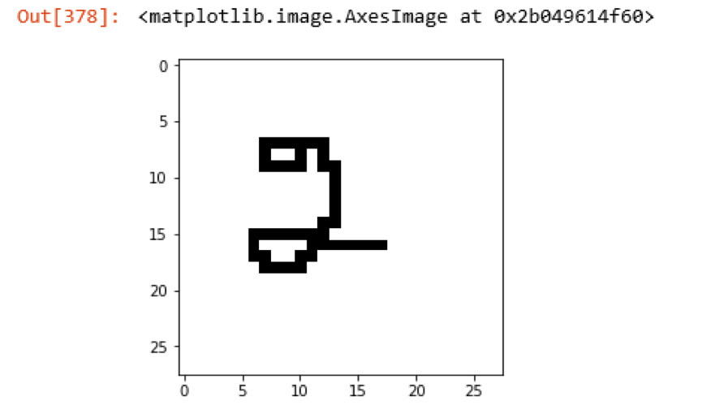

# DIGIT RECOGNITION
# Block Diagram

The dataset is imported. The matrix of each image in the dataset are stored in arrays. Then the image is taken as input. Pre-processing is done such that the image is converted to grey-scale image. Then the image is converted to array and is matched with the arrays of dataset. Thus, the digit is recognized.

# INPUT IMAGE

# OUTPUT

