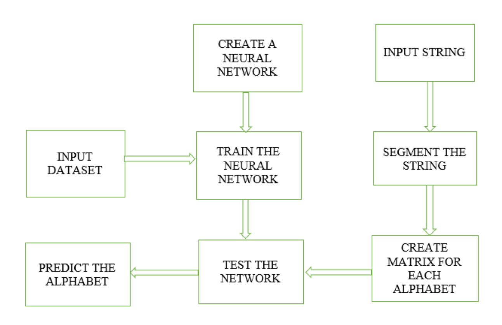
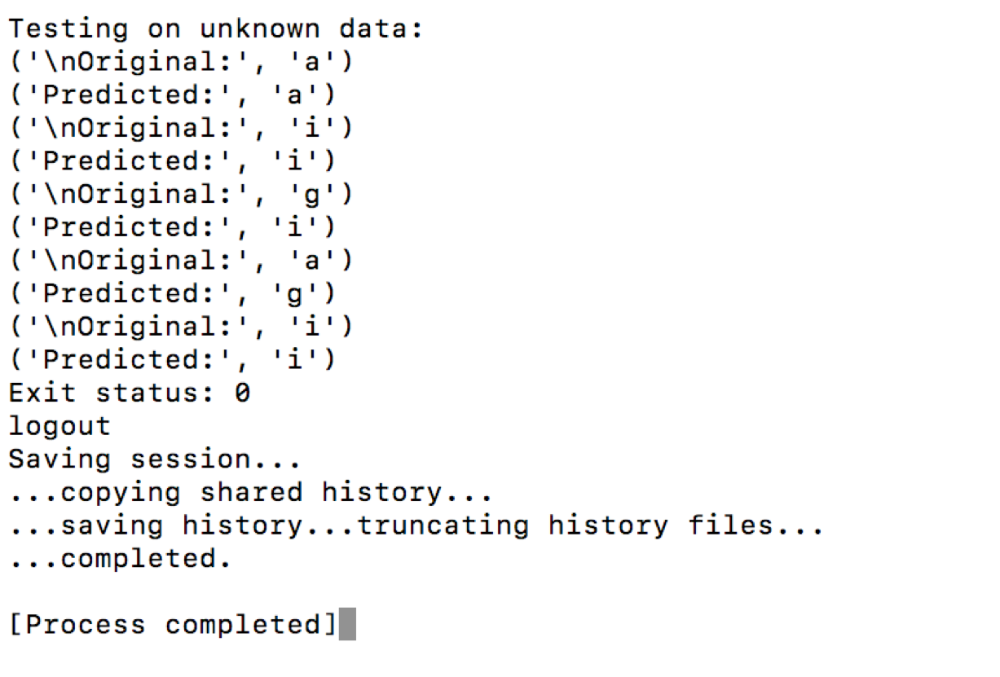

# ALPHABET RECOGNITION

# BLOCK DIAGRAM

This module matches the handwritten alphabets present in a dataset. This application takes a string as input and segments the string into separate alphabets. Matrix is formed for each alphabet. A feed forward neural network is created using neurolab. 
The feed forward neural network is trained with a part of the dataset and is tested with the alphabets present in the input. 
The neural network predicts the alphabets that matches the alphabets in the input string.

# OUTPUT

