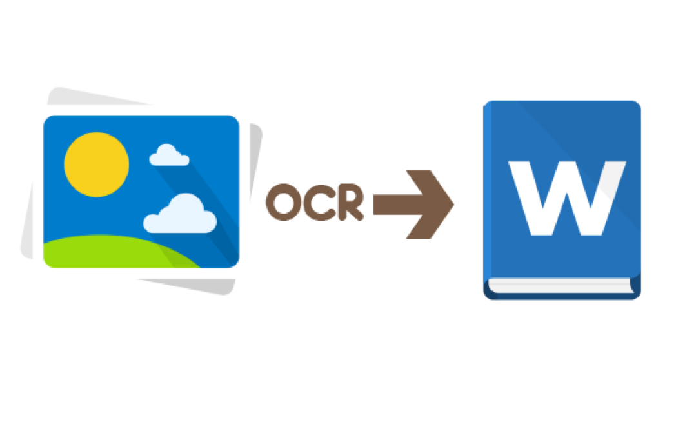
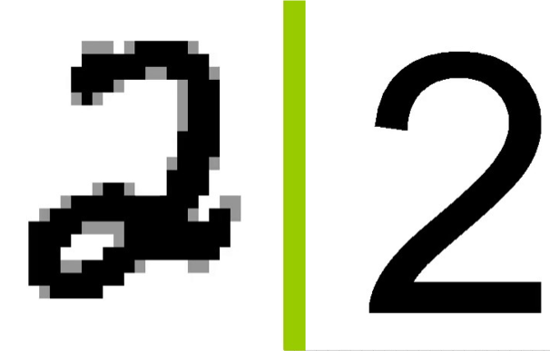
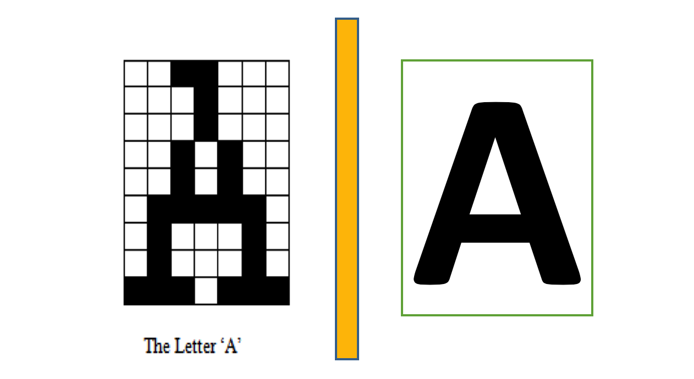

# Optical-Character-Recogonizer
A system that can recognize characters from an image.

  

# OCR is a process of converting images of typed, handwritten or printed text into machine-editable text.

It is a common method of digitizing the handwritten characters and printed text in an image. A digit can be written in a number of ways differing in shape and properties, such as tilt, stroke, cursivity and overall shape. One can easily recognize and read each digit. This is because the human perception processes the information by the features that define a digit’s shape in an overall fashion. Thus, while modelling the human perception model in machines an Artificial neural network( ANN) can be applied for classification of characters.

Artificial neural networks (ANNs)  are computing systems inspired by the biological neural networks that constitute human brains. Such systems "learn" (i.e. progressively improve performance on) tasks by considering examples.

# Dataset used: letter.data.gz
This dataset contains handwritten words dataset collected by Rob Kassel at MIT Spoken Language Systems Group.
The tab delimited data file contains a line for each letter, with its label, pixel values, and several additional fields listed in letter.names file. 
Fields
id: each letter is assigned a unique integer id
letter: a-z
next_id: id for next letter in the word, -1 if last letter
word_id: each word is assigned a unique integer id (not used) 
position: position of letter in the word (not used)
fold: 0-9 -- cross-validation fold
p_i_j: 0/1 -- value of pixel in row i, column j

# MODULE 1 – DIGIT RECOGNITION

# MODULE 2 – ALPHABET RECOGNITION

